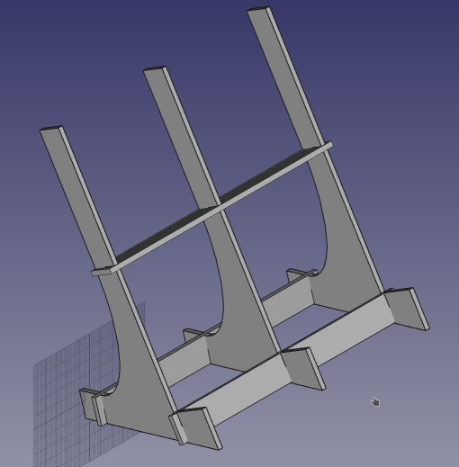

# laptop stand

A laptop stand to work with your laptop on your desk more comfortably and in a
more ergonomic position.

## Building

The stand is designed for laser cutting in plywood with 3.5mm thickness.

Import the pdf or svg file directly into your laser cutting software and print 
the two pieces thrice.

## Configuring

The CAD file was produced with [FreeCAD](http://www.freecadweb.org) 0.16.

You can adapt most dimensions and the laser kerf from the values in the
spreadsheet named 'Dimensions' inside the CAD project.
